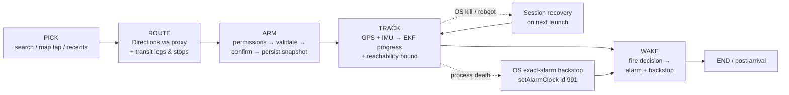
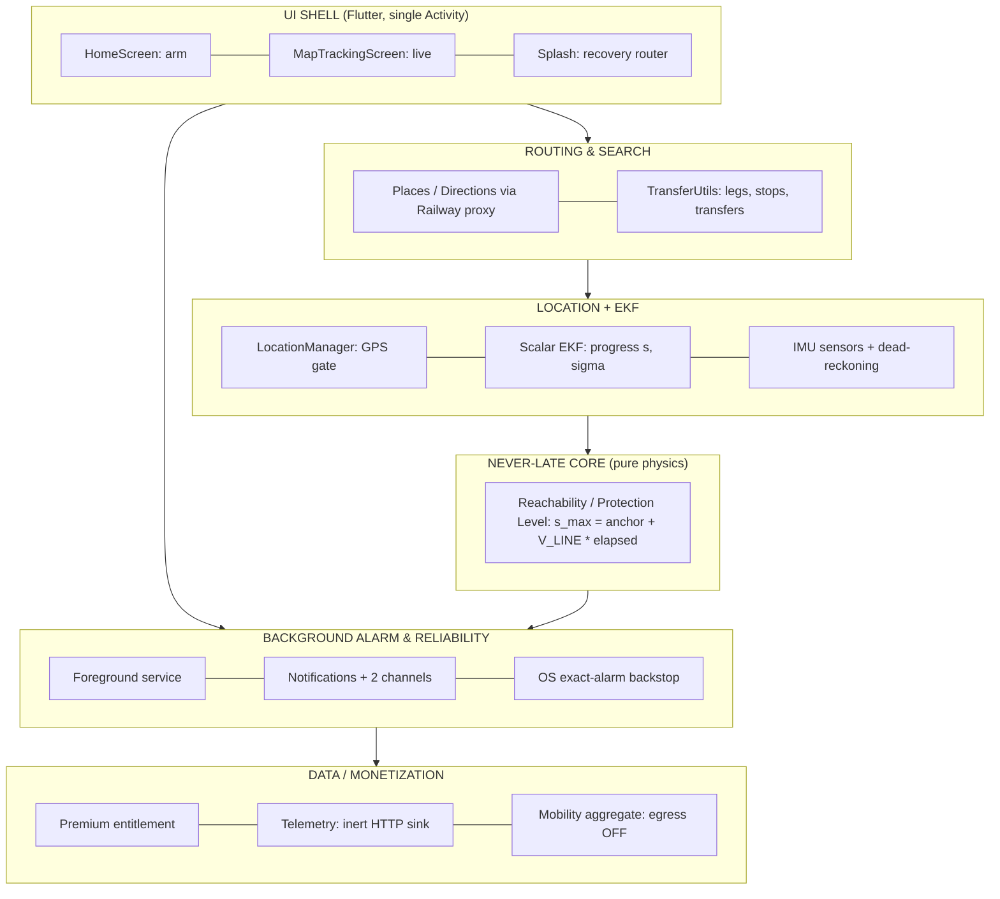
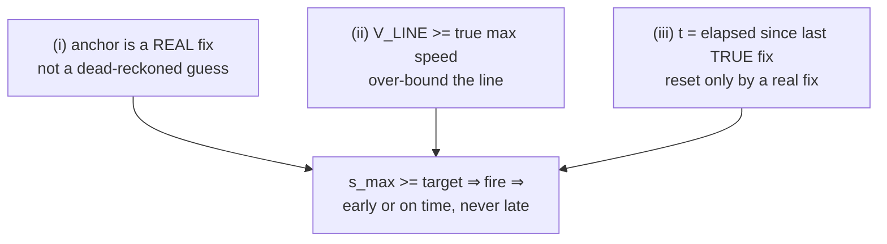
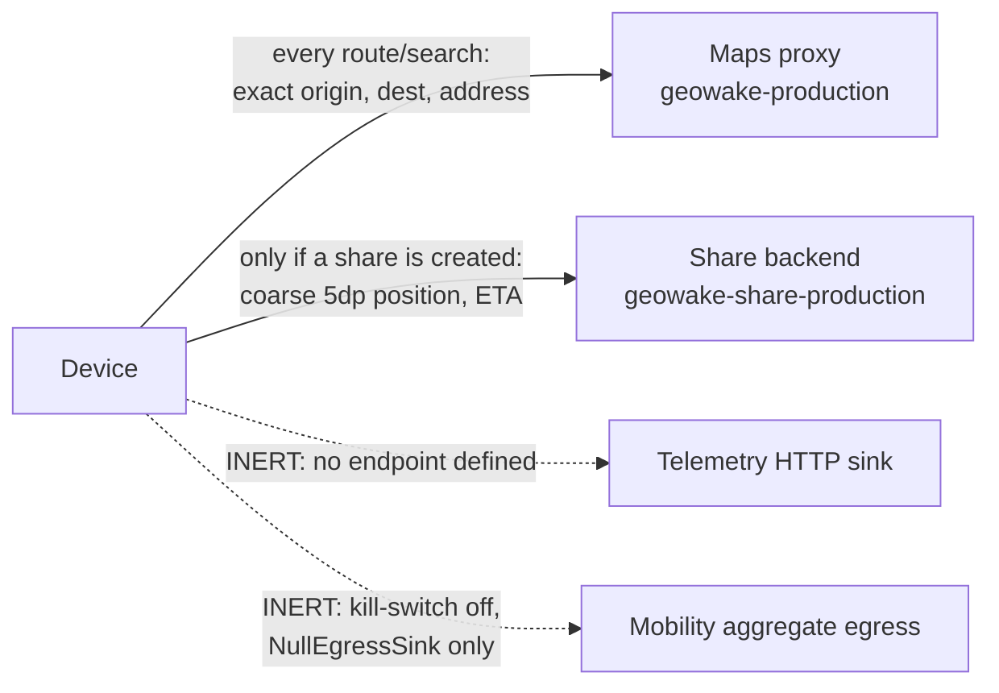

# GeoWake — Engineering Overview

> A warm, end-to-end tour of the codebase for a new engineer. Read this first, then dive into the per-subsystem docs it points you at.
>
> **Naming:** the user-facing product is always **GeoWake**. The repo directory is `WakePoint` and the Dart package is `geowake2` and the shippable Android package is `com.geowake.app` — never surface `geowake2` or `WakePoint` in any user-facing string.

---

## 1. What GeoWake is (and the one promise that matters)

GeoWake is a location-based **wake-up alarm for transit riders**. You tell it where you're going and how much lead time you want ("wake me 2 stops before" / "1 km before" / "15 minutes before"), you put your phone away, and it wakes you — loudly, un-dismissably — right before you need to get off. The killer use case is falling asleep on a metro, suburban train, or an overnight interstate sleeper and trusting the app to not let you miss your stop. Everything else in the app (search, maps, sharing, Pro) is scaffolding around that single job.

The product lives or dies on a two-sided promise: **never wake you late, and don't wake you annoyingly too early.** "Late" is catastrophic (you've missed your stop), so the whole engine is deliberately biased toward firing early when it's unsure. But "too early" is a real UX failure too — wake someone 10 stops out and they stop trusting the alarm. The crown jewel that makes "never late" a *provable physical fact* rather than a statistical hope is the **Reachability / Protection Level** core (Section 4). The rest of this document explains how a destination becomes an armed trip, how the app keeps tracking through tunnels and OS kills, and — honestly — which parts of all this are proven versus still simulation-only.

---

## 2. The 10,000-ft architecture

### The pipeline: pick → route → arm → track → wake



### The layers



**Mental model:** the UI never decides when to fire. It arms a background isolate and then just *displays* things. The background isolate fuses GPS + IMU into a progress estimate (LOCATION+EKF), asks the pure-physics **Reachability** core "could the train already be at the target?", and when the answer crosses the target it fires through the BACKGROUND ALARM layer — which also keeps an OS-owned exact alarm scheduled so the wake still happens even if the whole app process is killed.

---

## 3. The subsystems, one at a time

There are seven. Each section below is: **what it does → how it works (plain English) → open these files first → the gotchas that will bite you.**

---

### 3.1 App shell, navigation & the core user flow

**What it does.** The Flutter UI wrapper: it lets a rider pick a destination, choose how early to be woken, arm the alarm, watch the live trip, and end it. It is the human-facing shell around the background engine — and it deliberately runs *none* of the never-late physics itself.

**How it works.** GeoWake is a single-Activity Flutter app. `main.dart` installs three global error traps (`FlutterError.onError`, `PlatformDispatcher.onError`, `runZonedGuarded`) and then fire-and-forgets a pile of non-critical inits (ads, Guardian, data pipeline, home-widget, share) so a slow SDK can never delay startup. It's a `MaterialApp` with named routes resolved in `onGenerateRoute`.

Startup lands on **SplashScreen**, which is also the session-recovery router: if a trip was active (`TrackingStateStore.isActive()`), it loads the persisted snapshot and jumps straight to `/mapTracking` — this is the *only* path that resumes a trip after an OS kill. **HomeScreen** is the arming surface: destination + two independent mode switches ("Metro Mode" and "Time ↔ Distance/Stops") that resolve to a single mode string. Pressing **Wake Me!** runs the whole gauntlet in order — permissions → disclaimer → current position → optional metro snap → directions → sanity checks → a plain-language confirmation sheet → **persist the resumable snapshot** → start the tracking service. **MapTrackingScreen** draws the route, snaps live position, shows ETA/distance, and offers Stop/Snooze/End controls when the alarm fires.

**Open these first.**

| File | Why |
|---|---|
| `lib/screens/homescreen.dart` | THE arming screen; `_proceedWithDirections` is the full pick→validate→confirm→persist→start pipeline |
| `lib/screens/maptracking.dart` | Live tracking UI, tunnel banner, arrival/snooze/end controls |
| `lib/screens/splash_screen.dart` | Boot + the only session-resume path (`_checkStateAndNavigate`) |
| `lib/main.dart` | Entry, error traps, routes, deep-link handling |
| `lib/services/permission_service.dart` | The permission gauntlet fired on first Wake-Me press |

**Gotchas.**
- **Mode is derived, not stored as an enum.** It comes from two switches (`_metroMode` + `_useDistanceMode`); `'stops'` only exists when *both* metro and distance are on. Downstream, read the derived string (`'time'/'distance'/'stops'`) that's carried in nav args and the snapshot — never the booleans.
- **Snapshot is persisted *before* `startTracking`.** This ordering is what makes crash-recovery work. Don't reorder it. Post-`startTracking` steps (route registration, Guardian, route memory) are intentionally fire-and-forget so they can't delay or fail the arm→track→wake spine.
- **The map screen is cosmetic.** ETA/distance/tunnel-banner there are display only. The real fire decision runs in the background isolate. Do **not** try to "improve never-late" by editing the map screen.
- **Session resume is Splash-only.** If you add a field to `TrackingSnapshot`, both the save site (homescreen) and the restore site (splash) must agree or a resumed trip silently loses it.
- **Almost nothing here is real-device proven** — permission dialogs, OEM battery-killers, reboot-resume (documented broken on Android 14+, GW-0064), and the double-GPS battery cost all need a real phone. The offline replay harness never exercises the UI.

---

### 3.2 Destination search, geocoding, routing & transfers

**What it does.** Turns a typed/tapped destination into a Google Directions route, then decomposes that route into per-line transit legs, intermediate-stop positions, and transfer boundaries that the alarm engine tracks against.

**How it works.** Everything network-y routes through a **Railway HTTPS proxy** (`ApiClient` → `geowake-production.up.railway.app/api`) which forwards to Google Maps, so the app never ships a Google web-service key. Search debounces ~450ms, fuzzy-matches local recents, and calls Places Autocomplete (session-token'd for billing). Arming fetches directions via `OfflineCoordinator → DirectionService → ApiClient`. In metro mode it snaps the destination to the nearest station and can even force a metro plan when the metro is currently closed (retry with a future 09:00 departure). Routes are cached in-memory (tiered TTL) plus a Hive L2 cache, and the *pinned active route* survives past TTL so an offline re-arm/restore works.

The route→legs transform is the heart: `TransferUtils.extractTransitLegStops` flattens Directions steps into legs using **polyline-domain cumulative meters** (not Google's `distance.value`), places intermediate stops uniformly, and — in metro mode — `enhanceTransitLegStopsWithOsm` replaces those uniform estimates with real OSM station positions from the bundled `allIndiaStops` inventory. Critically, when the OSM count diverges from Google's count it **keeps the conservative uniform count** and flags low confidence — a smaller stop count would risk firing late, which is product death.

**Open these first.**

| File | Why |
|---|---|
| `lib/services/transfer_utils.dart` | 1857-line core: leg extraction, OSM enhancement, transfer boundaries |
| `lib/services/api_client.dart` | The single network chokepoint (Railway proxy, bundle-ID auth) |
| `lib/services/direction_service.dart` | Directions fetch, caching, metro preference/promotion |
| `lib/services/route_session_manager.dart` | Production consumer: builds, scale-corrects, persists, re-enhances legs |
| `lib/all_india_stops.dart` | Bundled ~13k-line OSM station inventory (source of truth for enhancement) |

**Gotchas.**
- **Two "is this metro?" predicates exist and disagree on purpose.** The canonical one for all alarm/leg logic is `TransferUtils._isMetroTransitStep` (membership of `kMetroVehicleTypes`, 8 types). `DirectionService.routeContainsMetroLeg` uses a narrower set and is only for route promotion + map styling — don't reuse it for tracking.
- **Meter domain is everything.** All legs/stops/boundaries use polyline-derived cumulative meters. Mixing in Google's API-distance meters silently shifts leg indices and breaks alarms.
- **`num_stops` is intermediate-only** (departure and arrival excluded); uniform estimates sit at `j/(n+1)` of the leg. These estimates are off the true station arc-position by up to **~1079m** on real geometry (GW-0193/0148) — never feed them to the never-late dwell cap.
- **The "nothing/coarse leaves the device" claim is false for routing.** Every origin/destination and the exact autocomplete address transit the founder-owned Maps proxy; the destination address is even rendered on the public share page (GW-0106/0103/0172).
- **Same-state cross-state validation is advisory-only now** — interstate sleepers are the flagship use case; only >24h total durations are refused. Don't re-add the old cross-state block.

---

### 3.3 The never-late wake core (Reachability / Protection Level)

This is the crown jewel; **Section 4 is the full friendly deep-dive.** Here's the one-paragraph version so the subsystem list is complete.

**What it does.** Computes a pure-physics worst-case-reachable-position bound — `s_max = last-real-fix + V_LINE × elapsed` — and fires the wake the instant the train *could* have reached the target stop, turning "never late" into a provable fact. Plus the controller wiring that keeps the anchor honest and folds the bound into the trigger decision.

**Open these first.**

| File | Why |
|---|---|
| `lib/core/reachability/reachability.dart` | The entire Protection Level, pure math (no clock reads → deterministically testable) |
| `lib/services/tracking/alarm_controller.dart` | Owns the tracker; per-tick anchor maintenance + bound build + backstops |
| `lib/services/alarm_evaluator.dart` | Consumes the bound via `effectiveProgress = max(statistical, physics)` |
| `SYSTEM_MAP.md` (Section 0) | Current-truth delta doc — trust this over the per-subsystem doc |

**Gotchas (the short list — see Section 4 for the rest).** The three tightening levers (dwell cap, fastest-feasible profile, hard T_max watchdog) are all **inert in production** — what ships is the free-run bound. `+infinity` means fire, `NaN` means ignore. Never-late is **not a whole-app property**. Distance and time modes **do** consult a controller-level physics bound (`reachBoundModes`); the one path that ignores it is the **non-metro STOPS final leg** (routed through `evaluateCoinciding`, GW-0161). Separately — and untested — the distance-mode bound caps speed at `VLineTable.defaultMps` = 28 m/s (100 km/h), so a car/highway trip faster than that is under-bounded and can fire late.

---

### 3.4 Alarm delivery & background reliability

**What it does.** The last mile: turn a "fire now" decision into an actual loud, un-dismissable wake — *and* keep an OS-owned exact alarm scheduled so it still rings after the whole app process has been killed.

**How it works.** When `AlarmController` decides to fire, `NotificationService.showWakeUpAlarm` posts a notification that is intentionally **silent** (`playSound:false`, `ongoing:true`, `FLAG_NO_CLEAR`). The actual noise comes from app code fired in parallel — `AlarmPlayer` (audioplayers, `USAGE_ALARM`, volume ramp) + a native escalating vibration waveform. This app-driven design only works *while a process is alive*.

The crown of this layer is the **process-death backstop.** Every ~1Hz, `notification_updater` re-schedules an OS-owned exact alarm via `AlarmManager.setAlarmClock` (id **991**) at `min(ETA-derived instant, physics never-late instant)`, so a mid-tunnel process death still wakes on the physics bound. It posts on a **separate self-sounding channel** carrying the system ALARM ringtone at the OS level, because when the process is dead no app code can make sound. For any of this to work the manifest must re-declare flutter_local_notifications' receivers (v16+ dropped auto-declaration).

**Open these first.**

| File | Why |
|---|---|
| `lib/services/notification_service.dart` | `showWakeUpAlarm`, the id-991 backstop, cross-isolate flags, `notificationTapBackground` |
| `lib/services/tracking/notification_updater.dart` | Re-arms the OS backstop ~1Hz at the never-late lead |
| `android/app/src/main/kotlin/com/example/geowake2/MainActivity.kt` | Native channels (silent alarm + self-sounding backstop), vibration |
| `android/app/src/main/AndroidManifest.xml` | The load-bearing re-declared FLN receivers (lines ~98-120) |

**Gotchas.**
- **Two alarm channels, never swap them.** `geowake_alarm_channel_v4` is intentionally SILENT (sound comes from live app code) and is useless after process death. `geowake_backstop_channel_v1` self-sounds with the OS ringtone precisely so a *dead* process can wake the rider. Channel settings freeze on first create — any change needs a new version suffix.
- **The manifest FLN receiver re-declaration is load-bearing, not boilerplate.** Remove it and the backstop intent fires but nobody catches it — silent never-delivery.
- **Notification id 888 is overloaded** (journey progress *and* the foreground-service notification) — root of GW-0066.
- **Cross-isolate action flags are single-consume**, drained by two independent consumers; benign only because they do equivalent work today.
- **Almost nothing here is provable in CI sim.** Audio audibility, vibration strength, DND, full-screen-intent grant, OEM battery-kill survival, reboot/direct-boot resume, and the backward-clock P0 (GW-0147) are all real-hardware-only. `AlarmReceiver.kt` is a 0-byte orphan — ignore it.

---

### 3.5 Location, sensors & EKF fusion

**What it does.** Answers the one question the whole app depends on: *how far along the planned route are we (progress `s` in meters), and how sure (σs)?* It's a hand-rolled scalar Extended Kalman Filter that fuses GPS with accelerometer/gyro so progress keeps advancing — and stays honest about uncertainty — even when GPS dies in a tunnel.

**How it works.** It collapses the 2-D world onto the route line and tracks state `[s, v, b]` (progress, speed, accel bias) with a 3×3 covariance. Fixes flow `LocationManager → LocationStreamHandler → SensorFusionManager → EkfOrchestrator`, which also ingests ~50Hz IMU. Per IMU tick: level the phone (pitch/roll only, **no yaw**), project acceleration onto the route tangent, classify motion (stationary/vehicle/human), detect zero-velocity stops (ZUPT), then Kalman-predict. GPS runs a Huber-robust update with a 25m variance floor; GPS *never* updates bias (bias is only observable at a true stop, so only ZUPT corrects it). On a confirmed stop, it snaps `s` to the identified station.

Everything leans **early = safe**: σs is allowed to grow to 3km during dead-reckoning (so the fire fractile trips sooner), a >1s sensor gap *coasts* at last velocity rather than freezing (freezing under-progressed and fired late in testing), and velocity is hard-clamped ±25 m/s everywhere `s` integrates. A Cauchy-Schwarz covariance-consistency repair runs before every Kalman gain — the documented fix for a real 518km single-tick spike.

**Open these first.**

| File | Why |
|---|---|
| `lib/core/ekf/ekf_pipeline.dart` | The actual filter + all numerical safety rails (coast cap, velocity clamp, σ cap, CS repair) |
| `lib/core/ekf/ekf_orchestrator.dart` | The conductor: detectors → predict, off-route rejection, cold-start, mode select |
| `lib/core/ekf/route_geometry.dart` | Polyline → math (`projectLatLng` GPS→s, returns NaN if >75m off route) |
| `lib/services/location_manager.dart` | Live GPS source + the accuracy gate |
| `lib/services/sensor_fusion.dart` | IMU↔GPS↔EKF bridge |

**Gotchas.**
- **The EKF is 1-D only** — progress along the *known* route. If the rider is off-route (reroute / wrong train / parallel line), off-route fixes are silently treated as "GPS unavailable" and it confidently dead-reckons down a route already abandoned.
- **No yaw / heading.** Forward accel is "level the phone, dot onto the route tangent" — correct only if the phone axes happen to align with travel. This is *why* the design leans so hard on ZUPT + station snaps and on firing early.
- **"Early is safe" latches.** Monotonic public progress can only ever agree we're further along; a bad surface over-progress never self-heals downward.
- **The spike fixes are load-bearing.** The ±25 m/s clamp, the CS repair, the 1500m coast cap, the 1600m/tick rate limit each individually prevented a real multi-hundred-km spike. They look redundant; they're defense-in-depth.
- **Dead-code traps.** `sensor_fusion.dart` ~228-245 is a physically-unsound raw-accel integrator writing to a stream nobody reads (GW-0083) — do not wire it up. `gps_health_monitor.dart` and the whole `lib/services/position/` package are never instantiated (the *correct* iOS background-location settings live only in that dead code).
- **The accuracy gate is permanently 100m** (`accuracyGateMeters` declared but never assigned — GW-0162). A coarse/Approximate-only ride drops every fix, the EKF never bootstraps, and the ride can **silently never fire** — the nastiest real-device bug here.
- **Tuning is corpus-fit.** ZUPT/motion thresholds are calibrated on Bengaluru replay rides, not broadly on-device. What's proven is "never fires late on a handful of Bengaluru metro rides, in simulation."

---

### 3.6 Premium/Pro, ads, consent & the data/telemetry pipeline

**What it does.** The monetization + data layer. A one-time "Pro" IAP (plus a rewarded day-pass) gates only *convenience* features; ads are forbidden anywhere near the alarm; and two data-egress surfaces (crowd telemetry + a k-anonymous/DP mobility aggregate) both currently ship **OFF** with zero data leaving the device. **The never-late alarm is free forever and never gated.**

**How it works.** The design rule that governs everything: **reliability/safety is never monetized.** `PremiumService` is a pure entitlement store whose always-free getters (`canUseCoreAlarm`, `canUseBackstopAlarm`, `canUseBasicReliability`) return `true` unconditionally; only convenience gates (Guardian, widget, custom sounds, ad-free) read `isPro`. Purchases are **fail-closed** (Pro granted only on a real purchased/restored stream event). `AdPolicy` is a pure decision function: alarm/wake/lockScreen are a hard denylist for *everyone*; only route-arming + map-tracking banners and a frequency-capped post-arrival slot are ad-eligible. Data flows run **fire-and-forget after the wake + teardown** (`ArrivalHooks`), so they can never delay the spine.

**Open these first.**

| File | Why |
|---|---|
| `lib/services/monetization/premium_service.dart` | Entitlement store + always-free vs Pro gates |
| `lib/services/monetization/ad_policy.dart` | Pure, unit-testable ad rules (alarm/wake hard-forbidden) |
| `lib/services/monetization/monetization_service.dart` | App facade — mutate entitlement through THIS, not PremiumService |
| `lib/services/data_asset/data_asset_config.dart` | The privacy bright-line consts (egress kill-switch, k=100, epsilon) |
| `lib/services/telemetry/telemetry_service.dart` | PII-free reliability funnels; HTTP sink inert until an endpoint is defined |

**Gotchas.**
- **Nothing is monetized yet in production.** AdMob uses Google TEST ad-unit IDs and a TEST app id; `configure()` is never called with real IDs. Both egress surfaces (telemetry HTTP sink + data-asset sink) ship inert. The data pipeline books **$0** and moves **zero bytes** today.
- **"Nothing leaves the device" is only true for *this* subsystem, not the app** — routing still sends raw origin/dest via the Maps proxy (GW-0103).
- **Hollow/partial Pro features, be precise:** Guardian mode is real and gated, but automatic SMS/WhatsApp delivery is a stub that falls back to the user's own composer. The home-widget bridge works but its Settings enable toggle (`WidgetSettingsTile`) is dead code (GW-0037), so there's no in-app way to turn it on. There is deliberately **no** Wear OS / family gate anymore — if an old memory note says "Wear/family falsely advertised," that's stale.
- **Entitlement is grant-only with no revoke path** (GW-0164) and a purely client-side flag (GW-0133) — a refund keeps Pro forever, and it's trivially tampered on a rooted device.
- **Report-a-problem claims "no location"** but embeds commute city + line telemetry (GW-0165).
- **Privacy is enforced in code, not just policy** — config tripwire tests assert the bright-line consts; the consent-off short-circuit is line one; only `NullEgressSink` may be wired while the kill-switch is off. Touching these will fail tests by design.

---

### 3.7 Build, release, packaging, signing & security posture

**What it does.** The Gradle/manifest build substrate, APK packaging, the signing story, and the two Node backends (Maps proxy + journey-share) that together decide whether GeoWake can actually ship — and how much leaks in the process.

**How it works.** A Flutter app built via `android/app/build.gradle` (Groovy). Identity is split: internal `namespace com.example.geowake2` (scaffold leftover) vs shippable `applicationId com.geowake.app`. SDK envelope: compileSdk 36 / targetSdk 35 / **minSdk 24** (Android 7, to reach cheap Indian phones). `versionCode`/`versionName` are now wired to `flutter.versionCode`/`Name` from pubspec `version: 1.0.0+1` — bump `+N` to cut a release. The Maps *tile* key is injected from a gitignored `key.properties`; all web-service calls go through the proxy so that key never ships in Dart. Release packaging runs R8 + resource shrink with hand-curated keep-rules for the reflective wake path.

Two backends, **do not conflate them:** `geowake-server/` is the Express Maps proxy (JWT-by-bundleId auth); `backend/share/` is a zero-dep, genuinely privacy-hardened journey-share server (latest-only store, TTL hard-delete, 5dp coarse rounding, constant-time auth).

**Open these first.**

| File | Why |
|---|---|
| `android/app/build.gradle` | SDK levels, namespace/appId split, R8 config, and the missing signingConfig |
| `android/app/src/main/AndroidManifest.xml` | Permissions, the load-bearing FLN receivers, App-Links, TEST AdMob id |
| `android/app/proguard-rules.pro` | R8 keep-rules for the reflective wake path (self-admits it's unproven on-device) |
| `geowake-server/src/server.js` | Express Maps proxy entrypoint |
| `backend/share/server.js` | Journey-share backend |

**Gotchas.**
- **Signing is the real release blocker (GW-0196), not versionCode.** There is *no* `signingConfigs` block and the release build has no `signingConfig`; `key.properties` holds only the Maps key. `flutter build apk --release` therefore emits an APK that installs with `INSTALL_PARSE_FAILED_NO_CERTIFICATES`. The older doc `docs/system_map/17_config_build_ios.md` blames a frozen versionCode — that's fixed; trust the code.
- **`key.properties` is misleadingly named** — it holds only the Google Maps key, not signing credentials.
- **Compiled-in "secrets" aren't secret.** The share bearer token is a `--dart-define` constant baked into `libapp.so`, recoverable with plain `strings` in all 3 ABIs (GW-0178). Treat `GEOWAKE_SHARE_TOKEN` and the API token as public once any release APK exists.
- **`namespace com.example.geowake2` ≠ `applicationId com.geowake.app`** — the lingering `com.example.*` invites copy-pasting the wrong identifier into assetlinks / IAP / server config.
- **Release wake-path is unverified.** R8 keep-rules are hand-curated with no release-mode on-device alarm smoke test — a stripped reflective MethodChannel would fail only in release, only on the wake path. Re-validate on a real signed build on an aggressive OEM after any R8/dependency change.

---

## 4. The never-late guarantee, explained like a friend would

This is the idea the whole product rests on. It's worth understanding deeply, so here's the intuition before any math.

### The problem

You're asleep on a metro. The train dives into a tunnel and **GPS dies for eight minutes.** A normal app's position estimate freezes — or, worse, a statistical dead-reckoner drifts and guesses you're *behind* where you really are, so it wakes you *after* your stop. That's the failure we refuse to allow. The EKF (Section 3.5) is a genuinely good statistical estimator, but on real underground rides it fires late 30-55% of the time. So **the never-late promise does not rest on the EKF at all.**

### The insight: bound the worst case, don't predict the average

Instead of asking "where *is* the train?" (hard, statistical, drifts), we ask a question physics can answer for certain: **"what's the furthest along the route the train could *possibly* be by now?"** Call that upper bound `s_max`. If even the *most optimistic physically-possible* train hasn't reached your stop yet, you're definitely safe to keep sleeping. The moment `s_max` reaches your stop, we fire — because the train *might* be there, and being early is fine but being late is not.

### The arithmetic (it's genuinely this simple)

```
s_max(t) = s0_hi + V_LINE × (t − t0)
```

- **`s0_hi`** = how far along the route the *last real GPS fix* put us — pushed **forward** by that fix's own accuracy (a fix that says "±40m" is treated as 40m *further along* than its point estimate, so we can't under-count). This is the **anchor**.
- **`V_LINE`** = a speed chosen to be *at least* as fast as the line's true top speed (tiered table: 28 / 39 / 53 / 56 m/s, up to ~200 km/h for RRTS/Airport Express). It's an over-bound, on purpose.
- **`(t − t0)`** = wall-clock time elapsed since that last real fix.

In words: *"start from the last place we truly saw the train, assume it's been flat-out at more-than-top-speed ever since, and that's the furthest it could be."* Through a tunnel, the anchor stays frozen while `t` keeps ticking, so `s_max` grows steadily toward your stop — which is exactly what eventually trips the alarm.

### Why it's a proof, not a hope

The guarantee reduces to three preconditions, and *every conceivable late fire violates exactly one of them* — so each is defended and tested:



1. **The anchor must be a real fix.** Dead-reckoned dropout positions carry a sentinel accuracy (9999) precisely so they're rejected — if a snapped/guessed tick re-anchored, `t` would reset and the bound would collapse underground. *The anchor is sacred; never call `onAcceptedFix` from a dead-reckoned tick.*
2. **`V_LINE` must over-bound true top speed.** A name-collision bug once under-bounded it (Airport Express mislabeled a slow "Orange Line") — fixed by also flooring V_LINE with a name-free `vehicle.type` ceiling (GW-0076).
3. **`t` must be elapsed-since-last-*true*-fix.** A monotonic guard drops any fix stamped earlier than the anchor, and late-delivered fixes are age-mapped so they can't shrink `t`.

### How it folds into the fire decision

The bound is passed to the evaluator, which combines it with the statistical estimate:

```
effectiveProgress = max(deadReckoned + sigmaCushion, reachBound)
```

A stop counts as reached as soon as **either** upper bound crosses it. `+infinity` (corrupt/non-finite input) forces a fire — *fail toward waking, never toward silence*; only `NaN` (no information) is dropped.

### The honest caveats a new dev must internalize

- **What actually ships is the free-run bound.** Three elegant tightening levers (topology dwell cap, fastest-feasible-train profile sweep, hard T_max watchdog) all exist in the file header but are **inert in production**. Don't assume they run.
- **It's deliberately inert until ~8s of blackout** (`reachBlackoutMinSeconds`). Below that, the statistical EKF governs so a healthy ride isn't biased `V_LINE × dt` early. If you test with a fresh anchor and see the bound "do nothing," that's correct.
- **Never-late is not a whole-app property.** Distance and time modes **do** consult the controller physics bound (`reachBoundModes`, `alarm_controller.dart:1248-1251` / `1138-1158`); the one path that ignores it is the **non-metro STOPS final leg** via `evaluateCoinciding` (GW-0161). A second, subtler hazard: the distance-mode bound floors max speed at 28 m/s (100 km/h, raised only by transit legs), so a faster car/highway trip is under-bounded — and **no test gates either gap**. Code comments oversell never-late as universal.
- **It trusts the snap it can't verify.** Reachability over-bounds progress *along* the route; it says nothing about being on the *right* route. Wrong branch → wrong `s0_hi` → guarantee breaks silently.
- **Sim-proven, not phone-proven.** The cone is deterministically proven (0 violations) on the oracle/harness, but the oracle historically re-anchored to *true* position, so the dominant real hazard — a noisy fix that anchors ~18% of the time *behind* true progress, worst 1650m (GW-0186) — was un-generatable. The V_LINE margin absorbs it on the 395-case matrix (LATE=0), but the residual (a train running *near* V_LINE, where the margin is thin — GW-0187) is only argued, not measured on hardware.

---

## 5. How state & data flow

### What's stored (all on-device)

| Store | Holds | Notes |
|---|---|---|
| `TrackingStateStore` / `TrackingSnapshot` (Hive) | The resumable trip: destination, mode string, route, thresholds | Persisted **before** `startTracking`; the only thing Splash reads to resume |
| `RecentLocationsService` (Hive, max 15) | Autocomplete-picked destinations | Dropped pins / drags are *not* saved (GW-0046) |
| `RouteCache` (Hive L2, 5-min TTL) | Fetched routes | Pinned active route bypasses TTL for offline survival |
| SharedPreferences | Entitlement blob, theme, cross-isolate action flags, API/share tokens | Tokens stored in **plaintext** (GW-0109); backupable (GW-0175) |
| `OdAggregator` (Hive) | k-anon station-to-station **counts only** | Never a coordinate; consent default OFF |
| Cross-isolate flags | Files in docs dir (`.gw_stop_alarm_flag` …) + prefs mirror | Single-consume; how a dead-app notification tap reaches the tracking isolate |

### What's sent anywhere (the honest egress reality)



- **Routing leaks by design.** Every origin/destination + the exact Places address transit the founder-owned Maps proxy. The blanket "nothing leaves the device" claim is **false** for routing (GW-0103/0172).
- **Sharing only emits once you create a share.** A basic-link share may still stream coarse position because `ingestLocation` ignores `ShareMode` (GW-0102). A cold launch with no active share showed **zero external egress** (GW-0191).
- **Telemetry + the mobility aggregate are genuinely off.** The telemetry HTTP sink no-ops without a `--dart-define` endpoint; the aggregate is triple-locked (`kDataAssetEgressEnabled=false`, only `NullEgressSink` wired, released cells unmintable on-device). Both book $0 and move 0 bytes.

---

## 6. Build, run & release quickstart

### The app-size / lag lesson (read this before you wonder why it's slow)

| Build | Size | What's inside | Why it matters |
|---|---|---|---|
| **Debug** | 244 MB APK / **~300 MB installed** | 88.8 MB interpreted `kernel_blob` (JIT) + all 3 ABIs + unminified dex | This is the **cold-start lag / ANR** (GW-0194). Don't judge performance from a debug build. |
| **Release (default)** | ~80 MB fat APK | R8-minified AOT, all 3 ABIs | AOT-compiled ≈ **~35 MB** per-ABI worth of real code; the fat APK just bundles 3 |
| **Release (`--split-per-abi`)** | **~40 MB per ABI today** | One ABI + the deliberately-bundled 20 MB `bengaluru.wkp` offline data | This is the intended sideload size *with* offline BLR data kept; it would drop to ~20 MB only if GW-0195's blob were removed — we're keeping it |

Debug ships a JIT interpreter kernel; release is AOT-compiled — that single fact is most of the size and startup-lag difference. Also baked into every build: a 20 MB `assets/osm/bengaluru.wkp` (today only dashboard/dev screens load it, GW-0195/0120 — but it is **intentionally kept bundled** as offline Bengaluru data) and a network-fetched Pacifico font that fails offline on first launch (GW-0119).

### Build & run

```bash
# Debug on a connected device/emulator (fast iteration, huge & slow app)
flutter run

# Release build — NOTE: currently emits an UNSIGNED apk (see below)
flutter build apk --release
flutter build appbundle            # for Play

# Smaller sideload:
flutter build apk --release --split-per-abi
```

### Signing (the current sharp edge — GW-0196)

There is **no `signingConfigs` block** in `android/app/build.gradle` and the release build type has **no `signingConfig`**. A clean `flutter build apk --release` therefore produces an **unsigned, uninstallable** APK (`adb install` → `INSTALL_PARSE_FAILED_NO_CERTIFICATES`). Until a real upload keystore + `signingConfig` are wired, testers hand-signed with the debug keystore:

```bash
# Interim: sign the unsigned release APK with the debug keystore to sideload
apksigner sign --ks ~/.android/debug.keystore \
  --ks-pass pass:android app-release.apk
apksigner verify app-release.apk
adb install app-release.apk
```

To actually ship: add a `signingConfigs.release` block sourced from a real keystore, reference it from `buildTypes.release`, and make sure the App-Links `assetlinks.json` SHA-256 matches that signing cert. To cut a new release, bump `+N` in `pubspec.yaml` (`version: 1.0.0+N`) — versionCode is now wired through.

### Install to a device

```bash
adb install -r app-release.apk
# Grant "Allow all the time" location + notifications when the gauntlet runs,
# and exempt from battery optimization / OEM autostart or the trip may be killed.
```

CI (`.github/workflows/ci.yml`) runs analyze + the never-late/reachability/replay gates + full `flutter test`, but **does not build, sign, split, or upload** any artifact — there's zero release automation. It is also **headless-only**: the `integration_test/` suite (Patrol, alarm-chain, backstop-doze) and the `test/maestro/` personas exist but are **gated by nothing in CI** — don't assume any device/emulator coverage is enforced.

---

## 7. Honest current status

### Genuinely done & proven (in simulation)

- **The never-late Protection Level math** — deterministically proven (0 violations) on the oracle/replay harness for metro-stops rides. Pure, clock-free, testable (Section 4).
- **The three-layer never-late stack wiring** — in-process bound + cold-start reach backstop + OS exact-alarm process-death backstop.
- **Fail-closed monetization + hard ad denylist** — entitlement logic, `AdPolicy`, post-arrival PII guard, consent state machine, and DP/k-anon math are all pure and unit-tested headless.
- **Data-asset egress genuinely inert** — triple-locked and asserted by tripwire tests (GW-0114).
- **Session-recovery ordering** — snapshot persisted before `startTracking`.

### Simulation-only (proven in the harness, NOT on a phone)

- Real-device dead-reckoning accuracy — tuning is Bengaluru-corpus-fit; cross-device behavior on cheap Android phones is **not** proven.
- Alarm audibility, vibration strength, DND behavior, full-screen-intent grant.
- OEM battery-kill survival, reboot / Direct-Boot resume (reboot-resume documented **broken** on Android 14+, GW-0064).
- The double-GPS battery cost (GW-0117) and cold-start lag on real hardware.

### Stubbed / advertised-but-partial

- **Guardian auto-delivery** — falls back to the user's own SMS/WhatsApp composer (no server gateway).
- **Home widget** — bridge works, but no in-app enable toggle (`WidgetSettingsTile` is dead code, GW-0037) and zero widget accessibility (GW-0166).
- **Ads & data pipeline** — TEST ad IDs only, both egress sinks inert; **$0 revenue, 0 bytes** today.
- **Signing / release automation** — none (GW-0196).
- **iOS is effectively unshipped.** Everything above (Gradle, manifest, OEM battery-killers, `adb`, the whole reliability story) is **Android-only**. There is no iOS onboarding or build guidance, and the *correct* iOS background-location settings live only in the never-instantiated dead `lib/services/position/` package. Treat iOS as greenfield.

### Top open risks (by severity)

| ID | Sev | Risk |
|---|---|---|
| **GW-0147** | P0 | Process-death backstop is armed on the wall-clock RTC; a **backward clock step** (NTP correction) during a blackout after a kill postpones the alarm → **late wake**. Sim-confirmed, needs real-device repro. |
| **GW-0001** | P0 | Alarm can be **silent** — `AlarmPlayer` ramps player-relative volume, never touches `AudioManager` STREAM_ALARM; a 0 alarm stream = vibration only. |
| **GW-0008** | P0 | OEM battery-killers (HyperOS autostart-off, Samsung sleep buckets) can stop the OS launching the process to service the exact alarm. Needs-device. |
| **GW-0162** | P1 | Accuracy gate permanently 100m (`accuracyGateMeters` never assigned) — a coarse/Approximate-only ride drops every fix and can **silently never fire**. |
| **GW-0196** | P1 | Release build is unsigned/uninstallable — can't produce a Play-uploadable artifact from a clean checkout. |
| **GW-0161** | P2 | The **non-metro STOPS final leg** (`evaluateCoinciding`) doesn't consult the reachability bound — no physics backstop on that one path, and **no regression test gates it**. (Distance/time modes *do* consult the bound; but the distance bound caps speed at 100 km/h, so faster car/highway trips are separately under-bounded — also untested.) |
| **GW-0064 / GW-0003** | P1 | Post-reboot / Direct-Boot: live tracking doesn't resume and the backstop isn't re-armed until first unlock on FBE devices. |
| **GW-0178 / GW-0010** | P1 | Share bearer token is a compiled-in, effectively-public single shared secret; share server leaves `/v1` writes open if the token is unset. |
| **GW-0012–0015** | P1 | Denying background-location or first-denying notifications **silently aborts the arm** — user believes they're protected but nothing is running. |
| **GW-0160 / GW-0186** | P1 | Metro anchor seeded from rate-limited EKF `_sPub` (can start below true progress); ~18% of gate-passing fixes anchor *behind* true progress. V_LINE margin absorbs it on the matrix; residual = train near V_LINE. |

### The one-line honest verdict

> The never-late promise is **real and provable** — but only for the metro-stops/metro-time paths, and only proven **in simulation on a handful of Bengaluru rides.** The biggest gaps are all at the real-hardware boundary (clock, coarse-location, OEM kills, signing) — treat those as unverified until a phone says otherwise.

---

### Where to go next

- **`SYSTEM_MAP.md` (Section 0)** — the current-truth delta doc; trust it over the older per-subsystem docs.
- **`docs/system_map/02_reachability.md`** — deep dive on the Protection Level (accurate on concepts, stale on line numbers).
- **`lib/core/reachability/reachability.dart`** — start here to actually feel the crown jewel; it's pure and readable.
- Then open `homescreen.dart` (arming) and `alarm_controller.dart` (the spine) side by side.
