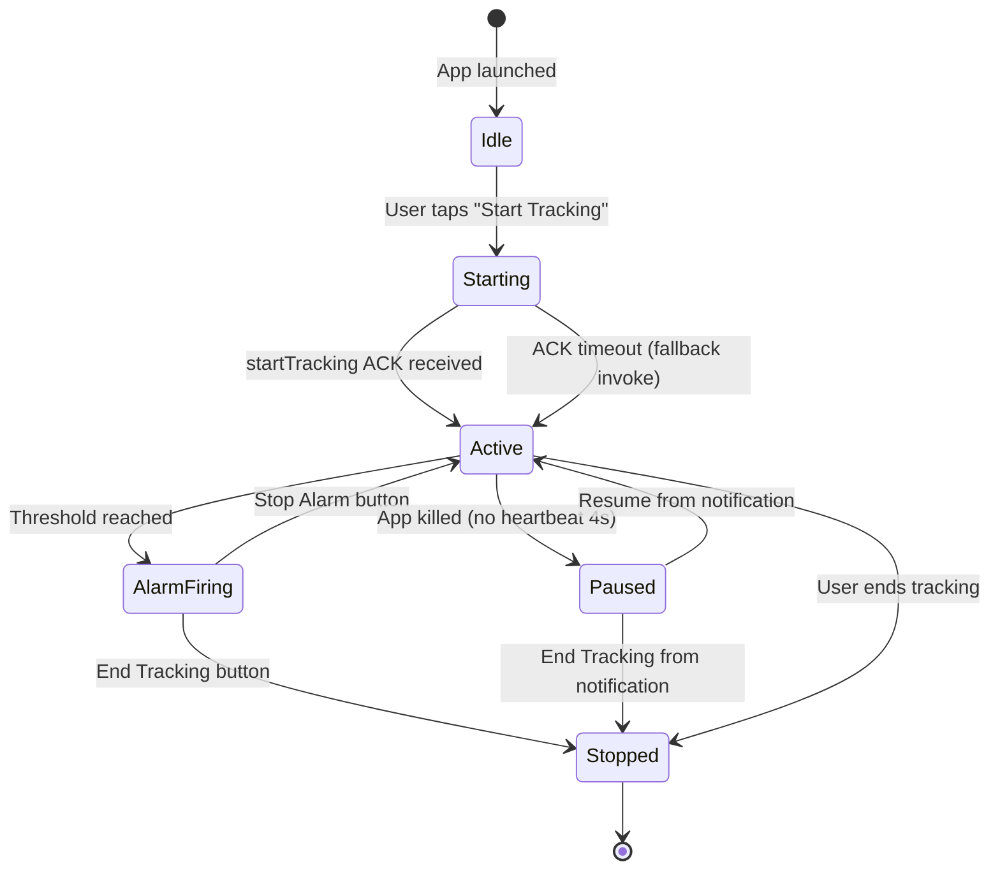
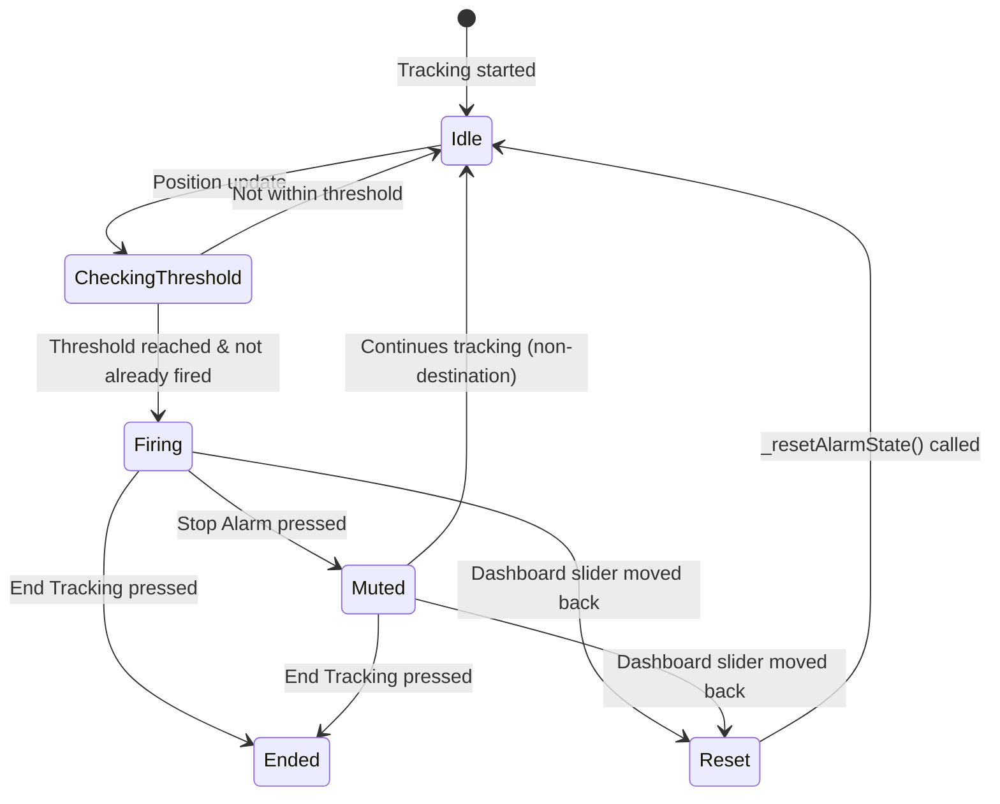
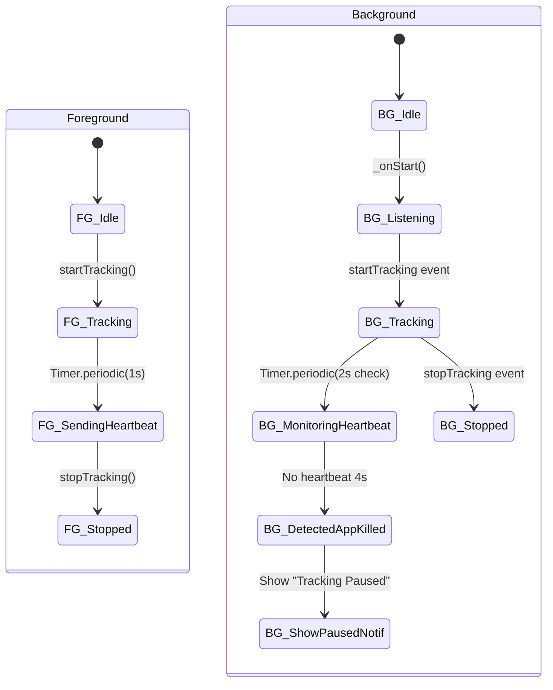
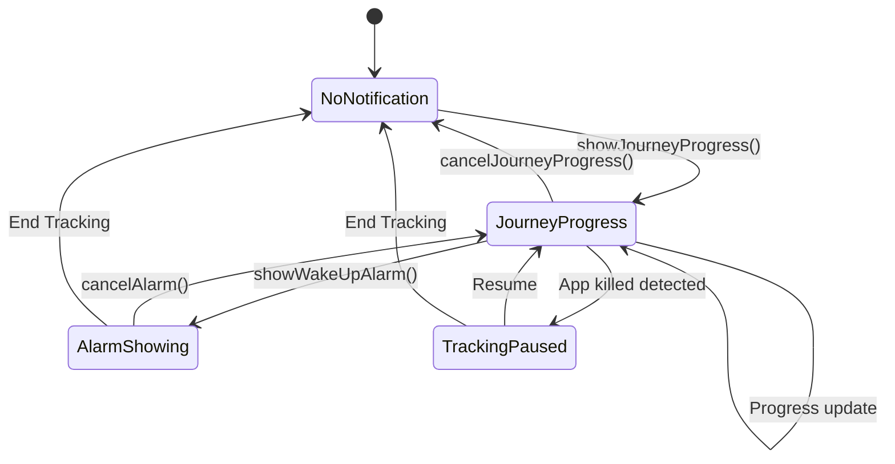
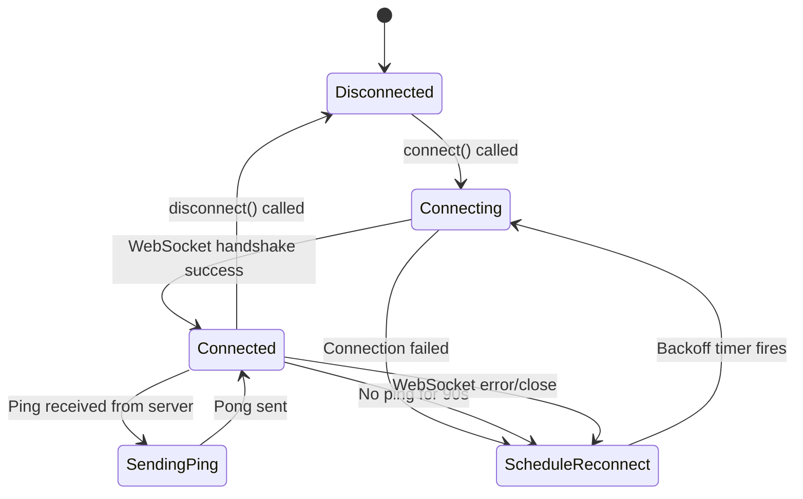
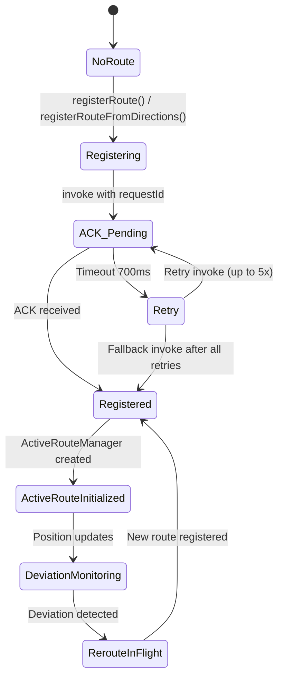

# PREEXISTING SNAPSHOT (UNVERIFIED)

- Source: `review/ai_audit_2025-12-18/STATE_MACHINES.md`
- Snapshot date: 2025-12-18
- Status: UNVERIFIED (preserved for traceability; do not treat as audit conclusions)

---

# GeoWake Forensic Audit - State Machines

**Last Updated:** 2025-12-18

## 1. Tracking Session Lifecycle



### State Ownership
- **Idle/Starting/Active/Stopped:** `_trackingSessionActive` in background isolate
- **Paused:** `tracking_paused_v1` in SharedPreferences
- **AlarmFiring:** `_destinationAlarmFired` + `_alarmCurrentlyShowing`

### Persistence Points
| State Transition | Persisted Keys |
|------------------|----------------|
| Idle → Active | `tracking_active_v1=true`, `tracking_snapshot_v1` |
| Active → Paused | `tracking_paused_v1=true` |
| Paused → Active | `tracking_paused_v1=false` |
| Any → Stopped | `tracking_active_v1=false`, clear snapshot |

---

## 2. Alarm State Machine



### Alarm Firing Guards
| Check | Variable | Location |
|-------|----------|----------|
| Destination not already fired | `_destinationAlarmFired` | trackingservice.dart:752 |
| Event not already fired | `_firedEventIndexes` | trackingservice.dart:753-754 |
| Destination priority | `destinationWithinThreshold` | trackingservice.dart:1457 |

---

## 3. Foreground/Background Isolate States



### Heartbeat Flow
1. **Foreground:** `_startForegroundHeartbeat()` → Timer sends every 1s
2. **Background:** `_startHeartbeatMonitoring()` → Timer checks every 2s
3. **Timeout Detection:** If `_lastForegroundHeartbeat` older than 4s → paused notification

---

## 4. Notification State Machine



### Notification IDs
| ID | Purpose |
|----|---------|
| 0 | Alarm notification |
| 888 | Journey progress (also foreground service) |
| 889 | Tracking paused |

---

## 5. SimulationClient Connection States



### Reconnect Backoff
```dart
delay = Duration(seconds: (1 << _reconnectAttempts).clamp(1, 30))
```
Sequence: 1s, 2s, 4s, 8s, 16s, 30s (max)

---

## 6. Route Registration State



### Route Registry Keys
Routes keyed by: `"route_${origin.lat}_${origin.lng}_${destination.lat}_${destination.lng}"`

---

## Invariant Observations (For Phase 2)

1. **INV-01:** `_destinationAlarmFired` MUST be reset when new tracking session starts
2. **INV-02:** File flags MUST be consumed (deleted) after processing to prevent re-triggering
3. **INV-03:** Heartbeat timer MUST NOT be stopped on `paused` lifecycle state (only on `detached`)
4. **INV-04:** Alarm notification MUST remain visible until button action (ongoing=true, additionalFlags)
5. **INV-05:** Background isolate MUST initialize NotificationService for proper channel setup
